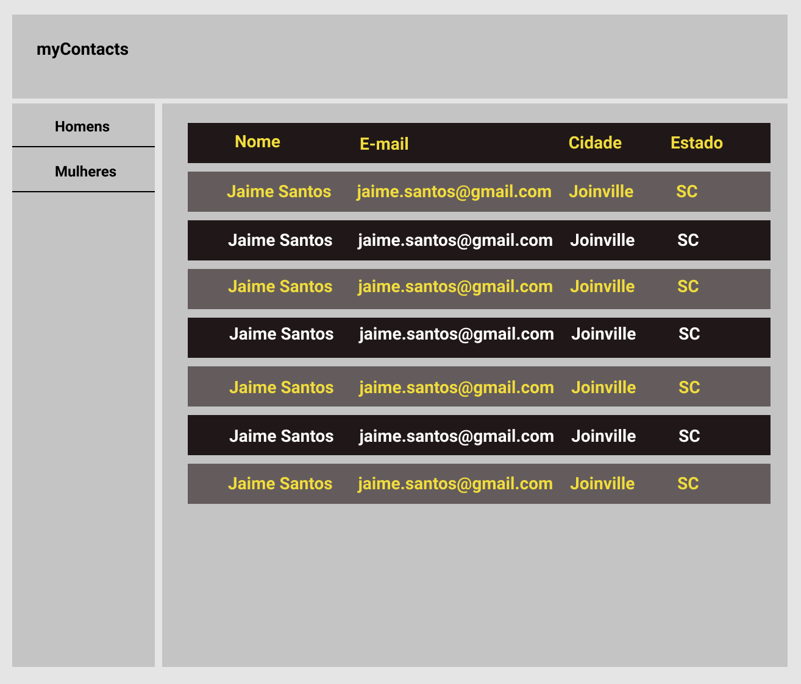

## Meus Contatos

Repositório destinado a demonstrar como podemos fazer o uso de requisições do lado do cliente, utilizando JavaScript para o servidor,
adotando [FetchAPI]( https://developer.mozilla.org/pt-BR/docs/Web/API/Fetch_API/Using_Fetch) e aplicando os conceitos de AJAX.

#### Exercício teórico

Baseado, no que vimos na primeira aula, responda as perguntas teóricas, submentendo para GoogleClassRoom suas respostas:

- O que é Internet?
- O que é XHR?
- O que é AJAX?
- O que é Single Page Applications(SPA)?
- O que é API?

#### Exercício prático

Baseado, no que estudamos agora vamos fazer a parte prática contemplando esses contextos acima:

Crie um clientApp (website), adotando HTML5, CSS3 e JavaScript (ES6), com a proposta de ser uma
lista de contatos, da qual deve ser implementado seguindo as diretrizes do wireframe proposto.

> Detalhes técnicos, sobre como fazer:

1. Acessar o site do [randowuser.me](https://randomuser.me/)
2. Criar uma página usando HTML e CSS
3. Criar uma interface com navbar, sidebar e content, conforme wireframe.
4. Criar requisições para API randowuser.me adotando Javascript (Vanilla).
5. Adicionar um menu lateral da qual teremos a opção sexo masculino e feminino.
6. Adicionar em content uma tabela informando os campos: `nome, cidade, estado e e-mail`.
7. Exibir apenas 40 registros.

> Pontos extras:

1. Desenvolver o layout usando abordagem de layout responsivo adotando flexbox ou cssgrid.
2. Pensar em como podemos deixar o código isolado e separado, pensando em [código limpo](https://devinduct.com/blogpost/22/javascript-clean-code-best-practices).

### Wireframe

### Dúvidas

Entrar em contato pelo e-mail [cristofer.sousa@ielusc.br](cristofer.sousa@ielusc.br) ou pelo nosso grupo do whatsApp.

Boa Diversão, Lets Code! 

